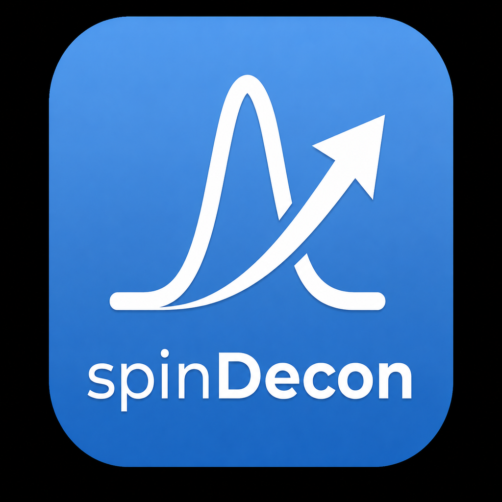

# spinDecon

spinDecon is a macOS-oriented scientific application for NMR data processing and deconvolution. The repository supports both a developer workflow from the source tree and creation of a self-contained macOS application and distributable DMG.



## Features

- Python/wxPython desktop application for spinDecon workflows.
- Native processing tools built as part of the project.
- FUDA and CATIA integration.
- Reproducible developer build using a project-local Python virtual environment.
- Self-contained macOS `.app` with an embedded Python runtime.
- Drag-to-Applications macOS DMG generation.

## Requirements

The current release workflow targets macOS. A developer build requires a C/C++/Fortran toolchain, `make`, Python 3, and the normal macOS command-line development tools. Python dependencies are installed automatically into `.venv` from `requirements.txt`.

Homebrew may be used to provide build tools and Python, but generated application bundles are designed not to depend on Homebrew paths at runtime.

## Build from source

Clone the repository and run:

```sh
make
```

The build creates `.venv`, builds the required native components, prepares portable runtime libraries, compiles Python bytecode, and runs the project doctor checks.

Launch the developer version with:

```sh
bin/spinDecon
```

To select a particular Python interpreter when creating the virtual environment:

```sh
PYTHON_BOOTSTRAP=/path/to/python3 make
```

## Build the macOS application

After the developer build succeeds:

```sh
make app
```

The application is created at:

```text
dist/spinDecon.app
```

The packaging step embeds Python and required Python packages, relocates native dependencies, checks for non-portable symlinks, signs the assembled bundle, verifies the signature, and performs a bundled-runtime smoke test.

## Build the macOS installer

Create a drag-to-Applications DMG with:

```sh
make dmg
```

`make installer` is an alias for the same target. The generated image is written under `dist/` and is verified with `hdiutil` before completion.

> The current local build uses ad-hoc code signing. Public distribution without Gatekeeper warnings additionally requires an Apple Developer ID and Apple notarization.

## Tests and diagnostics

Run the spinDecon test suite with:

```sh
make test
```

Run the complete build/diagnostic path with:

```sh
make
```

The doctor step validates the Python environment, required libraries, launchers, imports, and portable macOS dynamic-library dependencies.

## Cleaning

```sh
make clean
```

removes generated build/runtime output while retaining the developer environment. For a more complete reset:

```sh
make distclean
```

removes `.venv` and generated native runtime files as well.

## Repository layout

```text
applications/spinDecon/     spinDecon application source
applications/spinHubMain/   shared application/browser infrastructure
native/                     native FUDA, CATIA and processing sources
extern/                     vendored third-party source dependencies
assets/macos/               macOS application artwork and icon
scripts/                    bootstrap, diagnostics and packaging tools
bin/                        source launchers; generated binaries are ignored
LICENSES/                   third-party license texts
```

Generated environments, native build products, application bundles and DMGs are intentionally excluded from Git by `.gitignore`.

## Credits

spinDecon is part of the spinHub project, a community effort to make NMR an easier technique to bring into your molecular characterisation workflows. Please contact **Andrew Baldwin at Oxford University** for more information.

We are very grateful to a large number of contributors and testers who helped us get this project to this point including (but not limtied to!) Charlie Buchanan, Gogulan Karunanithy, James Eaton, Eugene Lin, Suzanne Lim, Abi Turner and Gary Thompson.

FUDA and CATIA are from **Flemming Hansen at UCL**.

spinDecon also uses third-party open-source software including FFTW and libLBFGS. See [`LICENSES/`](LICENSES/) for their license terms and the vendored source trees for upstream notices.

## License

The spinDecon project code is released under the [MIT License](LICENSE), except where third-party components are distributed under their own licenses. In particular, FFTW is distributed under the GNU General Public License and libLBFGS under the MIT License; see [`LICENSES/`](LICENSES/).
